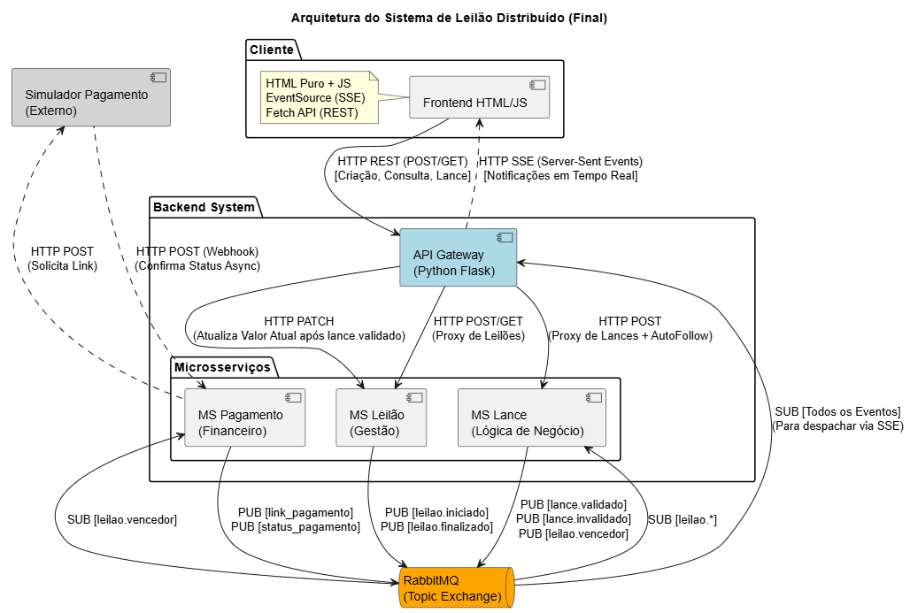

# MicroLeilão


Sistema de leilões online com arquitetura de microsserviços e comunicação orientada a eventos, utilizando RabbitMQ para mensageria assíncrona e Server-Sent Events (SSE) para notificações em tempo real.

---

##  Arquitetura do Sistema

O sistema é composto por microsserviços independentes que se comunicam através de eventos publicados em um **Topic Exchange** do RabbitMQ. O **API Gateway** centraliza as requisições HTTP dos clientes e distribui notificações via SSE.



**Padrões Implementados:**
- **Event-Driven Architecture**: Comunicação assíncrona via eventos
- **API Gateway Pattern**: Ponto único de entrada para clientes
- **Webhook Pattern**: Integração com sistema de pagamento externo
- **Publisher-Subscriber**: RabbitMQ Topic Exchange para broadcasting de eventos

---

##  Tecnologias Utilizadas

| Tecnologia | Versão | Finalidade |
|------------|--------|------------|
| **Python** | 3.8+ | Linguagem base do sistema |
| **Flask** | 2.x | Framework web para APIs REST |
| **Flask-CORS** | - | Habilitação de CORS no Gateway |
| **Pika** | 1.x | Cliente Python para RabbitMQ |
| **RabbitMQ** | 3.x | Message Broker (Topic Exchange) |
| **Requests** | 2.x | Cliente HTTP para comunicação REST |
| **Threading** | stdlib | Processamento concorrente |
| **Server-Sent Events** | - | Push de notificações em tempo real |

---

##  Estrutura do Projeto

```
MicroLeilão/
│
├── orchestrator.py                    # Orquestrador principal do sistema
│
├── ms-leilao/
│   └── ms-leilao.py                   # Microsserviço de Leilão (porta 5001)
│
├── ms-lance/
│   └── ms-lance.py                    # Microsserviço de Lance (porta 5002)
│
├── ms-pagamento/
│   └── ms-pagamento.py                # Microsserviço de Pagamento (porta 5003)
│
├── simulador-pagamento/
│   └── simulador-pagamento.py         # Simulador de Gateway de Pagamento (porta 5004)
│
├── api-gateway/
│   └── api-gateway.py                 # API Gateway + SSE Server (porta 5000)
│
├── cliente_front/
│   └── index.html                     # Interface web do cliente
│
└── arquitetura_microleilao.puml      # Diagrama PlantUML da arquitetura
```

---

##  Detalhamento dos Microsserviços

### **1. MS Leilão** (`ms-leilao.py` - Porta 5001)

**Responsabilidades:**
- Gerenciar o ciclo de vida dos leilões (agendamento, início, encerramento)
- Armazenar informações dos leilões (produto, valores, datas)
- Controlar estados dos leilões: `agendado` → `ativo` → `encerrado`
- Atualizar valor atual do leilão quando recebe requisições PATCH do Gateway

**Eventos Publicados:**
- `leilao.iniciado`: Quando um leilão começa
- `leilao.finalizado`: Quando um leilão termina

**Endpoints REST:**
- `POST /leiloes` - Criar/agendar novo leilão
- `GET /leiloes/ativos` - Consultar leilões ativos
- `PATCH /leiloes/<id>` - Atualizar valor atual do leilão

**Características:**
- Usa threads para agendar início/fim automático de leilões
- Armazena dados em memória com `threading.Lock` para thread-safety
- Converte timestamps para ISO 8601 ao publicar eventos

---

### **2. MS Lance** (`ms-lance.py` - Porta 5002)

**Responsabilidades:**
- Validar lances recebidos (valor maior, leilão ativo)
- Gerenciar estado dos lances por leilão
- Determinar vencedor ao final do leilão
- Manter registro do maior lance atual e ID do vencedor

**Eventos Consumidos:**
- `leilao.iniciado`: Registra leilão como ativo
- `leilao.finalizado`: Define vencedor e publica evento

**Eventos Publicados:**
- `lance.validado`: Lance aceito e registrado
- `lance.invalidado`: Lance rejeitado (valor insuficiente ou leilão inativo)
- `leilao.vencedor`: Notifica vencedor com ID e valor final

**Endpoints REST:**
- `POST /lance` - Receber tentativa de lance

**Regras de Negócio:**
- Lance só é válido se o leilão estiver com status `ativo`
- Valor do lance deve ser maior que o maior lance atual
- Apenas um vencedor por leilão (último maior lance)

---

### **3. MS Pagamento** (`ms-pagamento.py` - Porta 5003)

**Responsabilidades:**
- Integrar com sistema de pagamento externo (Simulador)
- Receber notificações de status de pagamento via webhook
- Propagar status de pagamento para o Gateway

**Eventos Consumidos:**
- `leilao.vencedor`: Inicia processo de pagamento

**Eventos Publicados:**
- `link_pagamento`: Retorna URL de pagamento ao vencedor
- `status_pagamento`: Notifica aprovação/recusa do pagamento

**Endpoints REST:**
- `POST /webhook/status` - Recebe callback do sistema externo

**Fluxo de Pagamento:**
1. Recebe evento `leilao.vencedor`
2. Envia requisição REST ao Simulador de Pagamento
3. Recebe link de pagamento imediatamente
4. Publica evento `link_pagamento`
5. Aguarda webhook assíncrono com status final
6. Publica evento `status_pagamento`

---

### **4. Simulador de Pagamento** (`simulador-pagamento.py` - Porta 5004)

**Responsabilidades:**
- Simular comportamento de gateway de pagamento externo (Stripe, PagSeguro, etc)
- Gerar links de pagamento fictícios
- Processar transações de forma assíncrona
- Notificar MS Pagamento via webhook

**Endpoints REST:**
- `POST /iniciar_pagamento` - Criar transação e retornar link

**Comportamento:**
- Retorna link de pagamento instantaneamente (resposta síncrona)
- Processa pagamento em thread separada (5 segundos de delay simulado)
- Envia webhook para `http://127.0.0.1:5003/webhook/status`
- Status padrão: `aprovado` (para facilitar testes)

---

### **5. API Gateway** (`api-gateway.py` - Porta 5000)

**Responsabilidades:**
- Centralizar todas as requisições REST dos clientes
- Rotear requisições para microsserviços apropriados
- Gerenciar conexões SSE (Server-Sent Events) dos clientes
- Distribuir eventos do RabbitMQ para clientes conectados via SSE
- Implementar lógica de **auto-follow** (inscrição automática ao dar lance)
- Sincronizar valor atual do leilão no MS Leilão quando lance é validado

**Eventos Consumidos (RabbitMQ):**
- `lance.validado`: Atualiza MS Leilão e notifica interessados
- `lance.invalidado`: Notifica apenas o usuário que fez o lance
- `leilao.vencedor`: Notifica todos os interessados no leilão
- `link_pagamento`: Notifica apenas o vencedor
- `status_pagamento`: Notifica apenas o comprador

**Endpoints REST:**
- `GET /leiloes` - Listar leilões ativos (proxy para MS Leilão)
- `POST /leiloes` - Criar leilão (proxy para MS Leilão)
- `POST /lance` - Efetuar lance (proxy para MS Lance)
- `POST /notificacoes/registrar` - Seguir leilão (inscrever-se para notificações)
- `POST /notificacoes/cancelar` - Desseguir leilão
- `GET /eventos?id_usuario=<id>` - Stream SSE de eventos em tempo real

**Eventos SSE Emitidos:**
- `novo_lance`: Lance validado em leilão seguido
- `lance_invalido`: Lance do usuário foi rejeitado
- `vencedor_leilao`: Leilão encerrado com vencedor
- `link_pagamento`: URL para pagamento (apenas vencedor)
- `status_pagamento`: Status final do pagamento (apenas comprador)

**Funcionalidades Especiais:**
- **Auto-follow**: Ao dar lance, usuário é automaticamente inscrito para receber atualizações daquele leilão
- **Notificação Seletiva**: Eventos são enviados apenas para usuários interessados no leilão específico
- **Reconexão RabbitMQ**: Loop infinito com retry a cada 5 segundos em caso de falha
- **Thread-safe**: Usa `threading.Lock` para proteger dicionário de clientes SSE

---

### **6. Orquestrador** (`orchestrator.py`)

**Responsabilidades:**
- Iniciar todos os microsserviços em ordem
- Gerenciar subprocessos Python de cada serviço
- Exibir logs coloridos de todos os serviços em um único terminal
- Abrir automaticamente o frontend no navegador
- Encerrar graciosamente todos os serviços com `Ctrl+C`

**Funcionalidades:**
- Detecção automática de caminhos (compatível Windows/Linux/Mac)
- Validação de existência dos arquivos antes de iniciar
- Captura e exibição de stdout/stderr de cada serviço
- Prefixo colorido para identificar origem dos logs
- Tratamento de sinais para shutdown limpo

---

## 🔄 Fluxo de Eventos Principal

**Ciclo de Vida de um Leilão:**

```
1. Cliente cria leilão → Gateway → MS Leilão
2. MS Leilão agenda início/fim em thread
3. [Hora de início] → MS Leilão publica `leilao.iniciado`
4. MS Lance consome e marca leilão como ativo
5. Cliente dá lance → Gateway → MS Lance
6. MS Lance valida e publica `lance.validado`
7. Gateway atualiza MS Leilão (valor atual) e notifica via SSE
8. [Hora de fim] → MS Leilão publica `leilao.finalizado`
9. MS Lance determina vencedor e publica `leilao.vencedor`
10. MS Pagamento inicia transação → Simulador
11. Simulador retorna link → MS Pagamento publica `link_pagamento`
12. [5s depois] Simulador envia webhook → MS Pagamento
13. MS Pagamento publica `status_pagamento`
14. Gateway notifica vencedor via SSE
```

---

##  Comunicação entre Serviços

**Comunicação Síncrona (REST):**
- Cliente ↔ Gateway
- Gateway ↔ MS Leilão (GET/POST/PATCH)
- Gateway ↔ MS Lance (POST)
- MS Pagamento ↔ Simulador (POST)
- Simulador ↔ MS Pagamento (Webhook POST)

**Comunicação Assíncrona (RabbitMQ):**
- MS Leilão → Topic Exchange → MS Lance
- MS Lance → Topic Exchange → Gateway
- MS Lance → Topic Exchange → MS Pagamento
- MS Pagamento → Topic Exchange → Gateway

**Comunicação em Tempo Real (SSE):**
- Gateway → Cliente (stream unidirecional de eventos)

---

